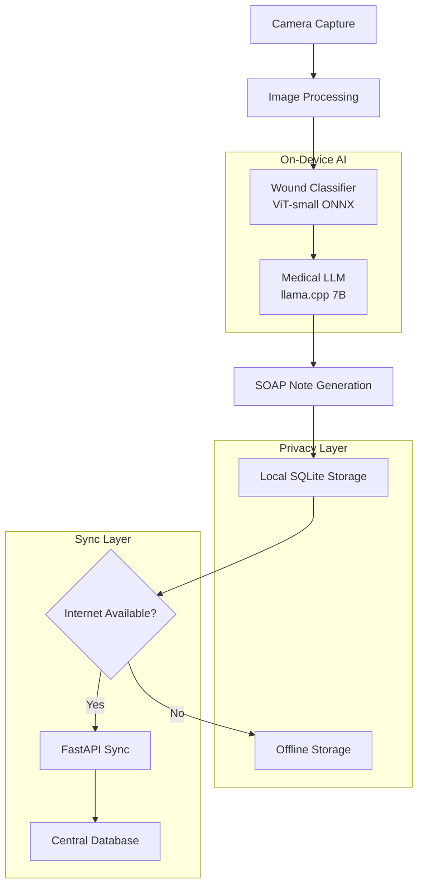

# MediMeld Edge

A privacy-first offline health app for wound analysis and SOAP note generation using on-device AI.

## Overview

MediMeld Edge is a React Native tablet application that enables healthcare professionals to:

- **Capture wound photos** with the device camera
- **Classify wounds** using an on-device Vision Transformer
- **Generate SOAP notes** using a quantized medical LLM
- **Store data locally** in SQLite for privacy
- **Sync when online** via a FastAPI backend

## Architecture



## Project Structure

```
medimeld-edge/
├── backend/                 # FastAPI server
│   ├── main.py             # API endpoints
│   ├── db.py               # Database manager
│   ├── schemas.py          # Pydantic models
│   ├── sync_push.py        # Test sync script
│   └── requirements.txt    # Python dependencies
├── mobile/                 # React Native app
│   ├── App.js             # Main app component
│   ├── screens/           # App screens
│   │   ├── CameraScreen.js
│   │   ├── DiagnosisScreen.js
│   │   ├── HistoryScreen.js
│   │   └── SyncScreen.js
│   ├── db/                # Database utilities
│   ├── utils/             # AI utilities
│   └── package.json       # Node dependencies
├── models/                # AI models
│   ├── wound_classifier.onnx  # ViT classifier
│   ├── medllm.gguf           # Medical LLM
│   └── README.md             # Model setup
└── .github/workflows/     # CI/CD
    └── ci.yml
```

## Quick Start

### Prerequisites

- Python 3.11+
- Node.js 18+
- Expo CLI
- iOS Simulator or Android Emulator

### Backend Setup

```bash
cd backend
pip install -r requirements.txt
python main.py
```

The server will start at `http://localhost:8000`

### Mobile App Setup

```bash
cd mobile
npm install
npx expo start
```

### Model Setup

1. Download the AI models (see `models/README.md`)
2. Place models in `models/` directory:
   - `wound_classifier.onnx` (~85MB)
   - `medllm.gguf` (~4.2GB)

## Configuration

### Backend Configuration

```python
# backend/main.py
app = FastAPI(
    title="MediMeld Edge API",
    description="Privacy-first offline health app backend",
    version="1.0.0"
)
```

### Mobile Configuration

```javascript
// mobile/App.js
const SERVER_URL = 'http://localhost:8000'; // Change for production
```

## Features

### Camera & Capture
- High-quality photo capture
- Flash control
- Gallery import
- Image preprocessing

### AI Analysis
- **Wound Classification**: 8 wound types, 4 severity levels
- **SOAP Generation**: Medical-grade notes
- **Offline Processing**: No internet required

### Data Management
- **Local Storage**: SQLite database
- **Privacy First**: No cloud storage of images
- **Sync Control**: Manual sync when online
- **Data Export**: Hash-based identification

### User Interface
- **Tablet Optimized**: Large touch targets
- **Medical UI**: Clean, professional design
- **Offline Indicators**: Network status display
- **Progress Feedback**: Loading states

## Privacy & Security

### Data Protection
- **No Image Upload**: Only photo hashes synced
- **Local Processing**: All AI runs on-device
- **Encrypted Storage**: SQLite with encryption
- **Hash-based IDs**: No personal data in syncs

### Compliance
- **HIPAA Ready**: Privacy-first design
- **GDPR Compliant**: Local data storage
- **Medical Standards**: SOAP note format
- **Audit Trail**: Complete sync history

## AI Models

### Wound Classifier
- **Model**: ViT-small-patch16-224
- **Input**: 224x224 RGB image
- **Output**: Wound type + severity
- **Size**: ~85MB (quantized)
- **Speed**: ~200ms inference

### Medical LLM
- **Model**: Meditron-7B or MedLlama2-7B
- **Input**: Wound classification + prompt
- **Output**: SOAP note text
- **Size**: ~4.2GB (Q4_K_M)
- **Speed**: ~2-5 seconds